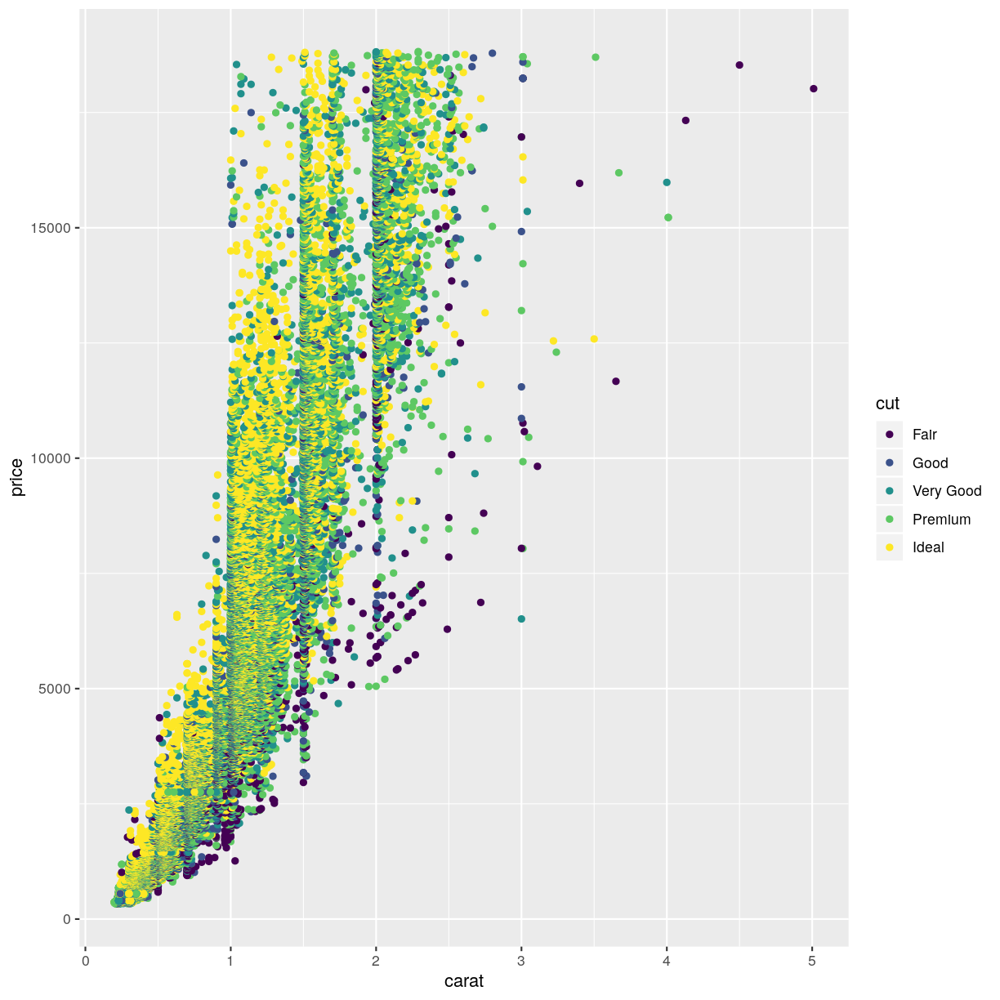

---
# Please do not edit this file directly; it is auto generated.
# Instead, please edit 05-rmarkdown-example.md in _episodes_rmd/
source: Rmd
title: "Using RMarkdown"
teaching: 10
exercises: 2
questions:
- "How to write a lesson using RMarkdown?"
objectives:
- "Explain how to use RMarkdown with the new lesson template."
- "Demonstrate how to include pieces of code, figures, and challenges."
keypoints:
- "Edit the .Rmd files not the .md files"
- "Run `make serve` to knit documents and preview lesson website locally"
---


This episode demonstrates all the features that can be used when writing a
lesson in [RMarkdown][r-markdown].

To generate the site, you will need to have the following packages installed:


~~~
install.packages(c("knitr", "stringr", "checkpoint"))
~~~
{: .language-r}

If the lesson uses additional packages, the script that converts the Rmd files
into markdown, will detect them and install them for you, when you run `make
serve` or `make site`.

This first chunk is really important, and need to be included at the beginning
of each episode written in RMarkdown. The first line ensures that the chunks
have the correct styling in the rendered website. The second line is optional
but allows you to ensure that figures that are generated by the lessons will
have the same prefix for each episode (you should use a different prefix for
each episode using the episode number for instance).


~~~
```{r, include=FALSE}
source("../bin/chunk-options.R")
knitr_fig_path("05-")
```
~~~
{: .output}

The rest of the lesson should be written as a normal RMarkdown file. You can
include chunk for codes, just like you'd normally do.

Normal output:


~~~
1 + 1
~~~
{: .language-r}


~~~
[1] 2
~~~
{: .output}

Output with error message:


~~~
x[10]
~~~
{: .language-r}


~~~
Error in eval(expr, envir, enclos): object 'x' not found
~~~
{: .error}

Output generating figures:


~~~
library(ggplot2)
ggplot(diamonds, aes(x = carat,  y = price, color = cut)) +
    geom_point()
~~~
{: .language-r}



For the challenges and their solutions, you need to pay attention to where the
`>` go and where to leave blank lines. You can include code chunks in both the
instructions and solutions. For instance this:

```
> ## Challenge: Can you do it?
>
> What is the output of this command?
>
>
> ~~~
> paste("This", "new", "template", "looks", "good")
> ~~~
> {: .language-r}
>
> > ## Solution
> >
> >
> > ~~~
> > [1] "This new template looks good"
> > ~~~
> > {: .output}
> {: .solution}
{: .challenge}
```

will generate this:

> ## Challenge: Can you do it?
>
> What is the output of this command?
>
>
> ~~~
> paste("This", "new", "template", "looks", "good")
> ~~~
> {: .language-r}
>
> > ## Solution
> >
> >
> > ~~~
> > [1] "This new template looks good"
> > ~~~
> > {: .output}
> {: .solution}
{: .challenge}


