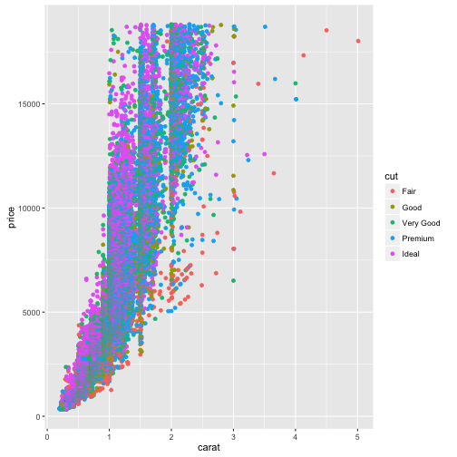

This episode demonstrates all the features that can be used when writing a
lesson in [RMarkdown][r-markdown].

To generate the site, you will need to have the following packages installed:


```r
install.packages(c("knitr", "stringr", "checkpoint"))
```

If the lesson uses additional packages, the script that converts the Rmd files
into markdown, will detect them and install them for you, when you run `make
serve` or `make site`.

This first chunk is really important, and need to be included at the beginning of
each episode written in RMarkdown.


~~~
source("../bin/chunk-options.R")
~~~
{: .language-r}

The rest of the lesson should be written as a normal RMarkdown file. You can
include chunk for codes, just like you'd normally do.

Normal output:


~~~
1 + 1
~~~
{: .language-r}


~~~
[1] 2
~~~
{: .output}

Output with error message:


~~~
x[10]
~~~
{: .language-r}


~~~
[1] NA
~~~
{: .output}

Output generating figures:


~~~
library(ggplot2)
ggplot(diamonds, aes(x = carat,  y = price, color = cut)) +
    geom_point()
~~~
{: .language-r}



For the challenges and their solutions, you need to pay attention to where the
`>` go and where to leave blank lines. You can include code chunks in both the
instructions and solutions. For instance this:

```
> ## Challenge: Can you do it?
>
> What is the output of this command?
>
> 
> ~~~
> paste("This", "new", "template", "looks", "good")
> ~~~
> {: .language-r}
>
> > ## Solution
> >
> > 
> > ~~~
> > [1] "This new template looks good"
> > ~~~
> > {: .output}
> {: .solution}
{: .challenge}
```

will generate this:

> ## Challenge: Can you do it?
>
> What is the output of this command?
>
> 
> ~~~
> paste("This", "new", "template", "looks", "good")
> ~~~
> {: .language-r}
>
> > ## Solution
> >
> > 
> > ~~~
> > [1] "This new template looks good"
> > ~~~
> > {: .output}
> {: .solution}
{: .challenge}


