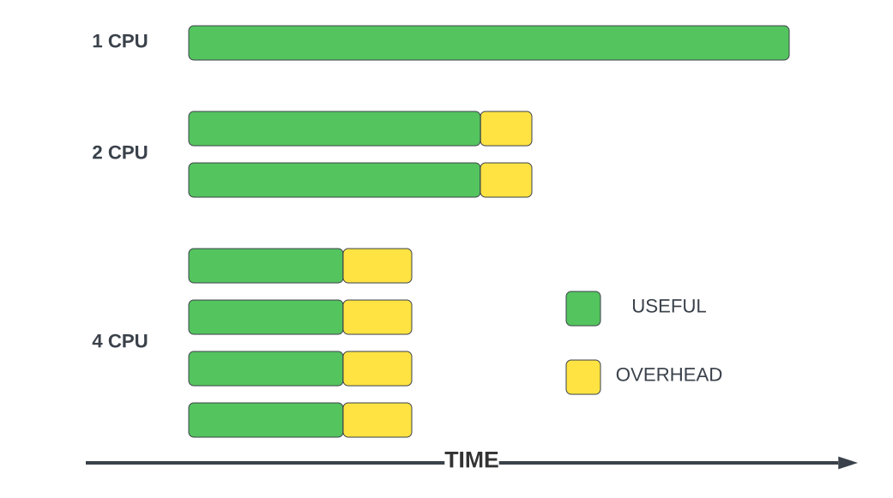
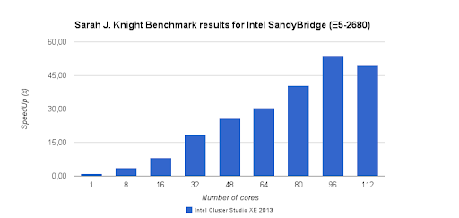
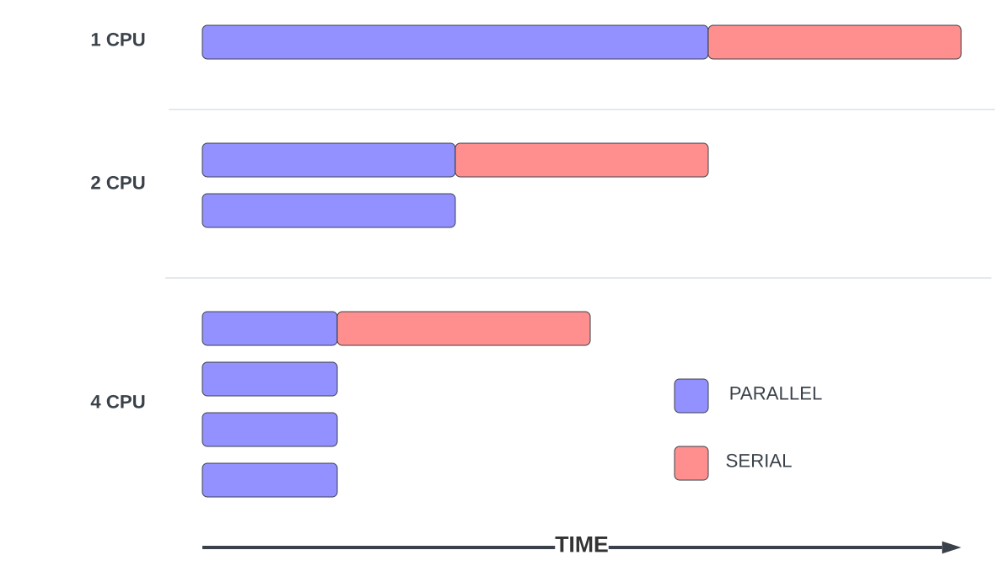

<!-- TODO: Add scaling example
Currently the rest of this lesson Not ready yet.  Too little info to go on without some sort of easy to grok exercise. -->


The aim of these tests will be to establish how a jobs requirements change with size (CPUs, inputs) and ultimately figure out the best way to run your jobs.

Unfortunately we cannot assume speedup will be linear (e.g. double CPUs won't usually half runtime, doubling the size of your input data won't necessarily double runtime) therefore more testing is required. This is called *scaling testing*.

## Scaling Test

Last time we submitted a job, we did not specify a number of CPUs, and therefore got the default of `2` (1 'core').

As a reminder, our slurm script `example-job.sl` should currently look like this.

```

```
{: .language-bash}


Using the information we collected from the previous job (`nn_seff <job-id>`), we will submit the same job again with more CPUs and our best estimates of required resources.
We ask for more CPUs using by adding `#SBATCH --cpus-per-task 4` to our script.

Your script should now look like this:

```

```
{: .language-bash}

And then submit using `sbatch` as we did before.

> ## acctg-freq
>
> We will also add the argument `--acctg-freq 1`.
> By default SLURM records job data every 30 seconds. This means any job running for less than 30 
> seconds will not have it's memory use recorded.
> This is the same as specifying `#SBATCH --acctg-freq 1` inside the script.
{: .callout}

```
{{ site.remote.prompt }} sbatch --acctg-freq 1 example-job.sl
```
{: .language-bash}



> ## Watch
>
> We can prepend any command with `watch` in order to periodically (default 2 seconds) run a command. e.g. `watch 
> squeue --me` will give us up to date information on our running jobs. 
> Care should be used when using `watch` as repeatedly running a command can have adverse effects.  
{: .callout}

Checking on our job with `sacct`.
Oh no! 


> ## OOM Error
> 
> 1. What went wrong?
> 2. What should be our next steps? 
> 3. How can we avoid this happening again in the future.
>
> > ## Solution
> >
> > The job failed due to an out of "OUT_OF_ME+(MORY)" error. This is because we doubled the number of 
> > CPUs over our previous job, but did not adjust memory.
> > The job running on 2 CPUs used ≈ 200Mb of RAM, extrapolating linearly, we want to give a 4 CPU job 400 Mb + small buffer, say 500Mb to be safe.
> > 
> {: .solution}
{: .challenge}

In order to establish an understanding of the scaling properties we may have to repeat this test several times, giving more resources each iteration.
> ## Scaling Exercise
>
> 1. Find your name in the [spreadsheet]({{ site.exersice }}) and modify your `example-job.sl` to request 
> "x" `--cpus-per-task`. For example `#SBATCH --cpus-per-task 10`.
> 2. Estimate memory requirement based on our previous runs and the cpus requested, memory 
> is specified with the `--mem ` flag, it does not accept decimal values, however you may 
> specify a unit (`K`|`M`|`G`), if no unit is specified it is assumed to be `M`. 
> For example `#SBATCH --mem 1200`. 
> 3. Submit the job with `sbatch --acctg-freq 1 example-job.sl`. 
> 4. Watch the job with `squeue --me` or `watch squeue --me`.
> 5. On completion of job, use `nn_seff <job-id>`.
> 6. Record the jobs "Elapsed", "TotalCPU", and "Memory" values in the spreadsheet. (Hint: They are the first 
> numbers after the percentage efficiency in output of `nn_seff`). Make sure you have entered the values in the correct format and there is a tick next to each entry. 
>
> > ## Solution
> > [spreadsheet]({{ site.exersice }})
> {: .solution}
{: .challenge}

## Scaling Behavior

### Diminishing Returns

Running code in parallel rarely comes for free, there are usually computational overheads. 
Whatever method is being used to distribute the workload usually require some computation, as well as communication between processes.

<!--  -->

This usually leads to diminishing returns when it comes to performance.




### Amdahl's Law

Most computational tasks will have a certain amount of work that must be computed serially.

<!-- 

As only the parallel portion of the job is sped up by scaling, the ratio of parallel to serial is an important factor in job scaling.  -->


Eventually your performance gains will plateau.


The fraction of the task that can be run in parallel determines the point of this plateau.
Code that has no serial components is said to be "embarrassingly parallel".

## Methods of Parallel Computing
Many scientific software applications are written to take advantage of multiple CPUs in some way. Often this must be specifically requested by the user at the time they run the program, rather than happening  automatically.

Three main types are shared memory, distributed and data level parallism. These methods are not exclusive, a job taking advantage of both SMP and MPI is said to be "Hybrid".

Which methods are available to you is _largely dependent on the software being used_, if you are writing your own code, then this is something you will probably have to specify yourself.
### Shared-Memory (SMP)

Shared-memory multiproccessing divides work among _CPUs_ ( threads or cores ), all of these threads require access to the same memory. This means that all CPUs must be on the same node, most Mahuika nodes have 72 CPUs.

Number of CPUs to use is specified by the Slurm option `--cpus-per-task`.


```

```
{: .language-bash}


### Distributed-Memory (MPI)

Message Passing Interface (MPI) is a communication standard for distributed-memory multiproccessing.
Distributed-memory multiproccessing divides work among _tasks_, a task may contain multiple CPUs (provided they all share memory, as discussed previously). 

Each task has it's own exclusive memory, tasks can be spread across multiple nodes, communicating via and _interconnect_. This allows MPI jobs to be much larger than shared memory jobs. It also means that memory requirements are more likely to increase proportionally with CPUs.

The NeSI platforms have _Hyperthreading_ enabled (not worth getting into). This means there are two _logical cpus_ per physical core. Every task— and therefore every job must have an even number of CPUs.

Distributed-Memory multiproccessing predates shared-memory multiproccessing, and is more common with classical high performance applications.

Number of tasks to use is specified by the Slurm option `--ntasks`, because tasks do not share memory you will also likely want to specify memory using `--mem-per-cpu` rather than `--mem`. Unless otherwise specified, each task will have `--cpus-per-task=2` (the minimum amount).


```

```
{: .language-bash}

### Job Array

Job arrays are not "multiproccessing" in the same way as the previous two methods.
Ideal for _embarrassingly parallel_ problems, where there are little to no dependencies between the different jobs.

Can be thought of less as running a single job in parallel and more about running multiple serial-jobs simultaneously.
Often this is a type of _Data level parallelism_ where the same process is run on multiple inputs.

Embarrassingly parallel jobs should be able scale without any loss of efficiency. If this type of parallelisation is an option, it will almost certainly be the best choice.

A job array can be specified using `--array`

```

```
{: .language-bash}


<!-- > > ## Solution
> >
> >  1. No: `pwd` is not the name of a directory.
> >  2. Yes: `ls` without directory argument lists files and directories
> >     in the current directory.
> >  3. Yes: uses the absolute path explicitly.
> {: .solution}
{: .challenge} -->


